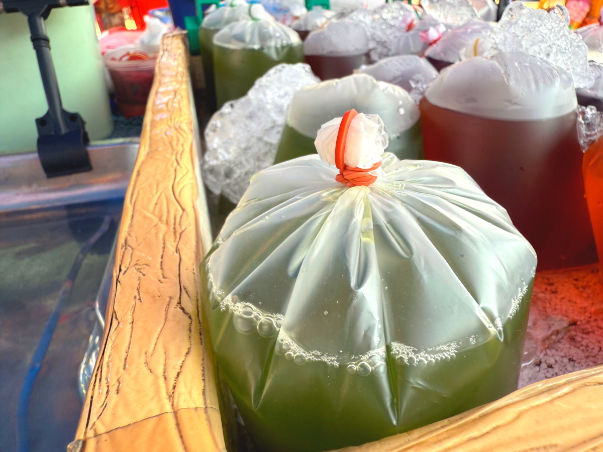
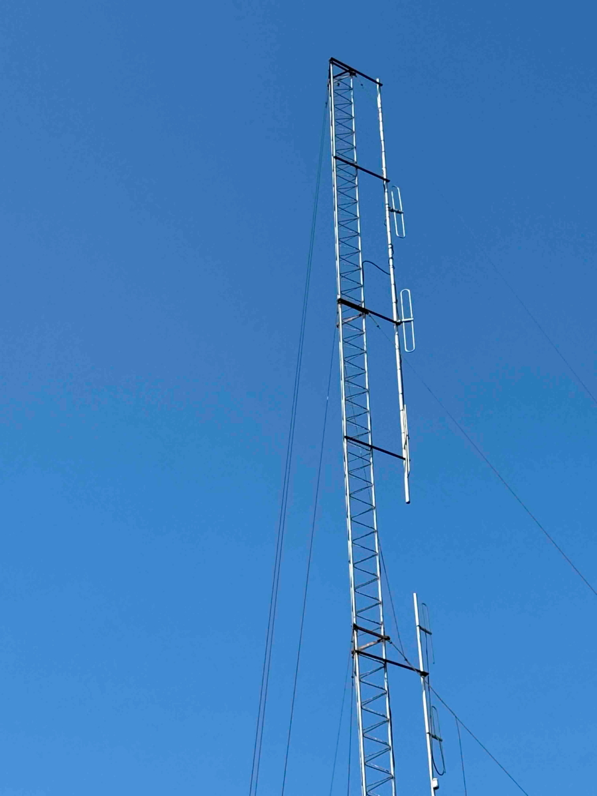
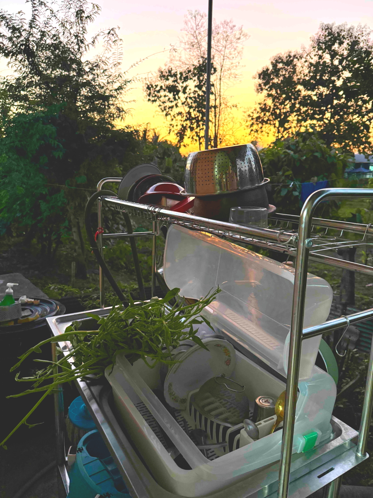

# 20241224_chiangrai

<html>
<head>

<meta charset="UTF-8">
<meta http-equiv="Content-Type" content="text/html; charset=UTF-8">
<meta http-equiv="X-UA-Compatible" content="IE=EmulateIE10" />
<meta http-equiv="X-UA-Compatible" content="IE=edge">

<!--ここから上はお決まりの定型文です-->

<!--ここからが表現の書式などを決めるcssという部分-->

<link href="https://cdnjs.cloudflare.com/ajax/libs/lightbox2/2.7.1/css/lightbox.css" rel="stylesheet">

</head>

<body>

モバイル端末をお使いの場合は、画面を横向きにすると
より見やすくご覧頂けます。

<!--ここ上は、ほぼそのまま使います！-->

<!--QRコードの挿入例-->

 アクセス用QRコード

<marquee direction="left" scrollamount="20" width="30%">(^_^)/~alis</marquee>

<!--流れ文字の挿入例-->
<h1><marquee behavior="left">!!! 2024/12/24 、日本とは違うタイの特徴を何点かまとめました !!!</marquee></h1>

                          

<!--ここから下が、本体部分-->

<h2>今回のビニール袋を閉じる輪ゴムマジックの市場はこの辺り 例によってGoogleMapsをそのまま埋め込みました</h2>

<iframe src="https://www.google.com/maps/embed?pb=!4v1735093046822!6m8!1m7!1s8BiEmlfsINFVyEA2x2FBCA!2m2!1d20.22443932575729!2d99.94861903097876!3f270.05588460078474!4f-0.07190411519819406!5f0.7820865974627469" width="600" height="450" style="border:0;" allowfullscreen="" loading="lazy" referrerpolicy="no-referrer-when-downgrade"></iframe>

<h2>日本ではあまり見ないと思いますが、ビニール袋の閉じ方はこのやり方が当たり前</h2>

<iframe width="560" height="315" src="https://www.youtube.com/embed/SYO-ax-psxE?si=yL19Be4-lH37zGhZ" title="YouTube video player" frameborder="0" allow="accelerometer; autoplay; clipboard-write; encrypted-media; gyroscope; picture-in-picture; web-share" referrerpolicy="strict-origin-when-cross-origin" allowfullscreen></iframe>

<h2>閉じられたビニール袋はこんな感じで液漏れしません</h2>

<h2>警察署などの公共施設にもれなく立ってるアンテナ</h2>

<h2>警察署には近づけなかったので、同じアンテナがあった学校のものをアップで撮影 アマチュア無線的知見からすると430Mhz近辺の電波を使った自立通信システムに見えます</h2>

<h2>車を運転していて一番驚くのは、交差点の信号システム</h2>

<h2>青になるまでのカウントダウンは普通に表示してますが、青になる順番は日本が二系統なのに対しタイは四系統 簡単に言うと青の間は他の交通は全部止まってるので直進も右折もスムーズにできます 止まっている時間が長めになるのはやむなしですが、右折が楽なのはいいですね ちなみに左折は赤の間でも安全確認できればいつでもOK</h2>

<h2>一般的なショッピングモールのフードコートはすごく綺麗です</h2>

<h2>セルフサービスで箸やスプーンはここから取りますが、左上の熱湯で殺菌してから使います</h2>

<h2>熱湯システムがないところでは、ビニールパックされた状態で配布されてました 雑菌の強さが日本より一段上ですね</h2>

<h2>一般家庭の台所は屋外なので、洗い終わった食器を夕陽が照らします</h2>

<h2>田舎の空気は綺麗なので、星はいっぱい見えました オリオン座だけ線入れてあります</h2>

<h2>
<a href="https://torokoid.github.io/20241126_chiangrai/" target="_blank">Back to the menu page</a>
</h2>

   

   

         

  

      

<!--本体はここまで-->

<!--画面に空白地帯を作って、背景が見えるようにしています-->
                                              

<!-- フッタ -->
<footer>

Copyright 2024/12/25 alis @ChiangRai

</footer>

<!--HPにさまざまなJavaScriptを呼び込むための書式-->

